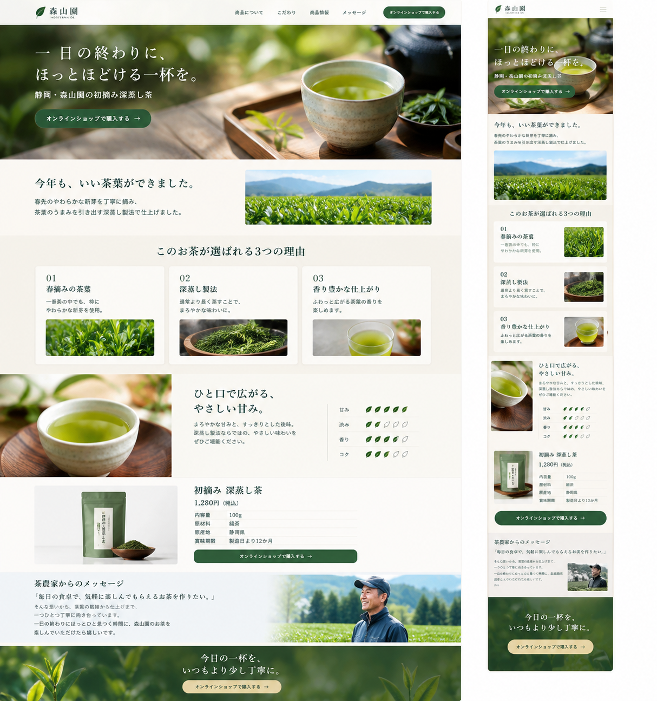
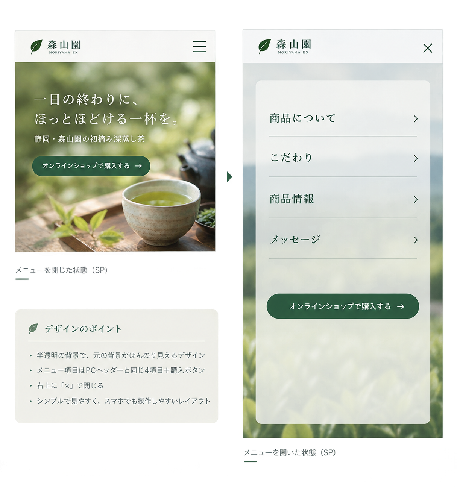

# MORIYAMA GREEN TEA

## 概要

静岡県の小さなお茶農家「森山園」の新商品
「初摘み 深蒸し茶」を紹介するランディングページ。

オンラインショップへの購入導線を目的とした
レスポンシブLPを制作。

## クライアント

森山園（もりやまえん）

静岡県の小さなお茶農家。
自社で栽培した茶葉をオンラインで販売している。

## LPの目的

「初摘み 深蒸し茶」の魅力を伝え、
オンラインショップへの購入につなげる。

## ターゲット

30〜50代女性。

「せっかく飲むなら、ちょっといいお茶を選びたい」
という層。

## 使用技術

- HTML
- CSS
- JavaScript

## 対応

- PC：1440px
- SP：375px
- レスポンシブ対応
- 〜767px：SPレイアウト
- 768px〜：PCレイアウト
- 1440px超：コンテンツに最大幅を設定し、左右に余白を作る

## ページ構成

1. FV
2. INTRODUCTION
3. FEATURE
4. TASTE
5. PRODUCT
6. MESSAGE
7. CTA

## デザイン

### カラー

- メイン：#3F5B45
- サブ：#D9C99A
- 背景：#F7F5EE
- 文字：#333333
- 白：#FFFFFF

### 雰囲気

ナチュラル・上品・落ち着いた雰囲気。

「お茶＝和風」に寄せすぎず、
和紙・筆文字・家紋などのデザインは使用しない。

### イメージ画像

- SP/PC
  

- menu
  

## 制作記録

### 制作開始

2026/09/12
制作開始。
GitHubリポジトリ作成。

### FV完成

### 各セクション

### レスポンシブ

### 微調整

### 完成

## 振り返り

### 工夫したこと

### 苦労したこと

### 時間がかかったところ

### 次回改善したいこと
